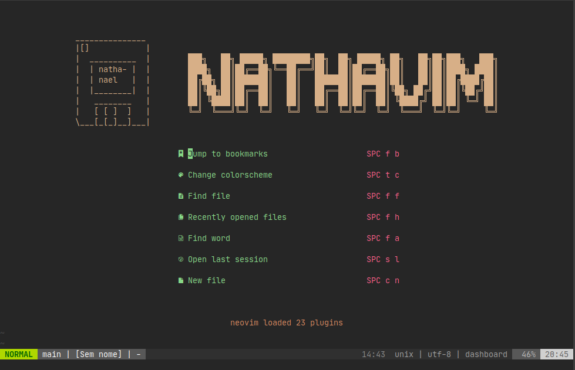
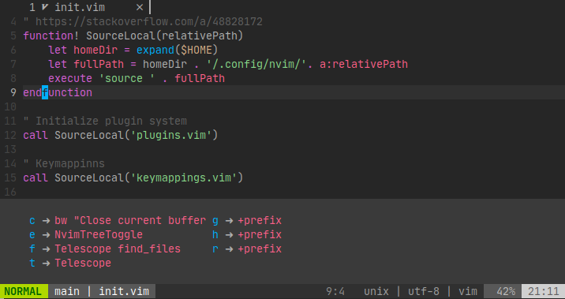
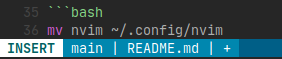
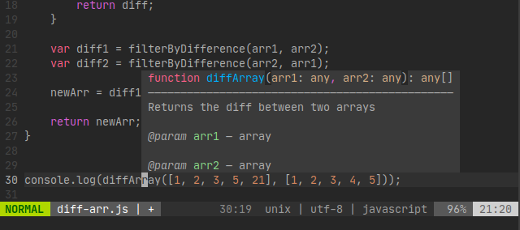
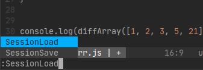
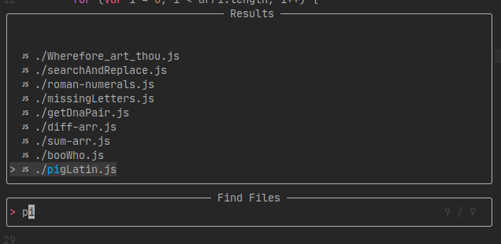
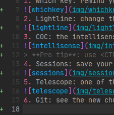
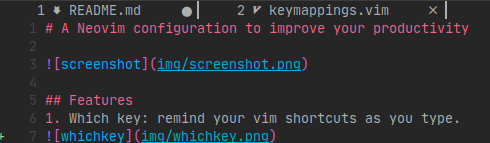
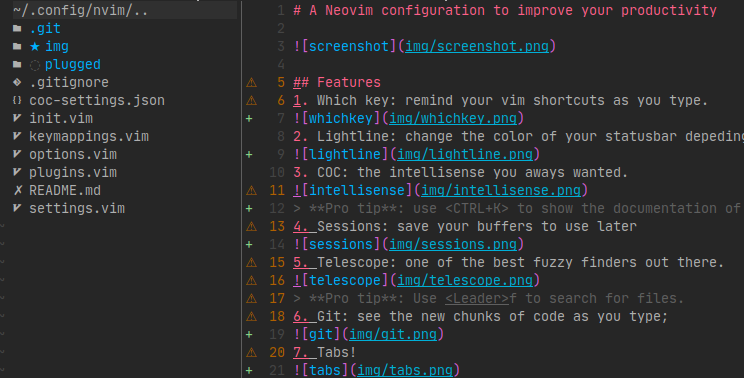

# A Neovim configuration to improve your productivity



## Features
1. Which key: remind your vim shortcuts as you type.



2. Lightline: change the color of your statusbar depeding on the mode you're in.



3. COC: the intellisense you aways wanted.



> **Pro tip**: use <CTRL+K> to show the documentation of a function on hover.
4. Sessions: save your buffers to use later



5. Telescope: one of the best fuzzy finders out there.



> **Pro tip**: Use <Leader>f to search for files.
6. Git: see the new chunks of code as you type;



7. Tabs!



8. NvimTree: a file tree at the tip of your fingers.



> **Pro tip**: Use <Leader>e to toggle the filetree.

7. And much more!

## How to install

1. Download the latest Neovim version [here](https://github.com/neovim/neovim/releases)
2. Make sure to add the executable to your $PATH.

3. Clone this repository in your **/tmp** directory

```bash
cd /tmp
git clone https://github.com/nathabonfim59/nvim-config nvim
```
4. Remove previos nvim configurations (backup your folder if you don't want to lose yours)

```bash
rm -rf ~/.config/nvim
```

5. Move the folder to your **~/.config** directory

```bash
mv nvim ~/.config/nvim
```

6. Install [vim-plug](https://github.com/junegunn/vim-plug)

```bash
sh -c 'curl -fLo "${XDG_DATA_HOME:-$HOME/.local/share}"/nvim/site/autoload/plug.vim --create-dirs \
       https://raw.githubusercontent.com/junegunn/vim-plug/master/plug.vim'
```

7. Open your nvim
8. Install the plugins

```vim
:PlugInstall
```

9. Enjoy your new VIM! (Neovim, got it?) Anyways, if you find a bug or
   something, fell free to open an issue or a pull request.  Have a good one.

## Aditional information
1. In this config, the **<Leader>** is configured to be <Space>, but yout can
   easily change that by going to the [keybindings](keymappings.vim) file.

2. How do I know the custom shortcuts?
> You can look at the [keymappings](keymappings.vim) file or just start
> pressing around. We have Whichkey to help you out.
